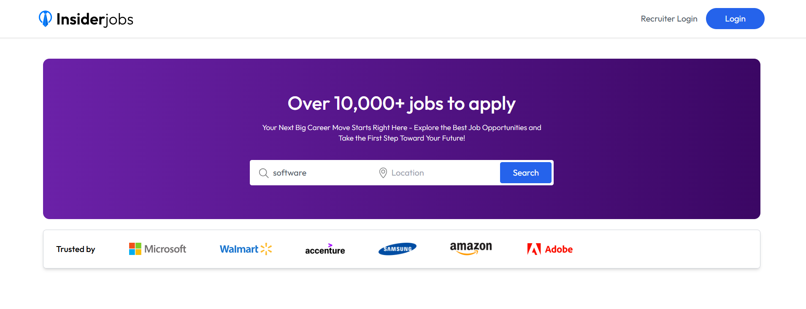
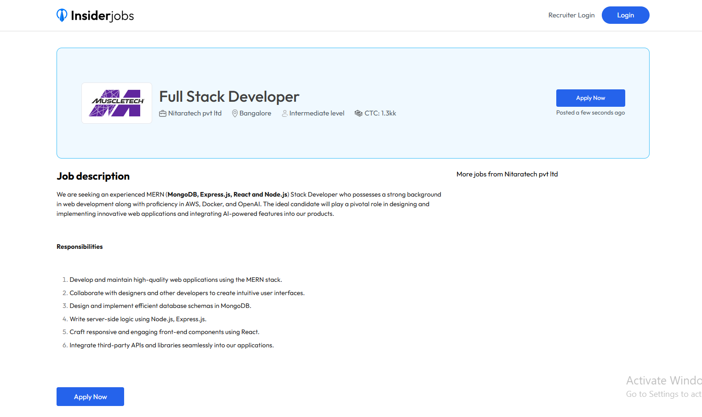
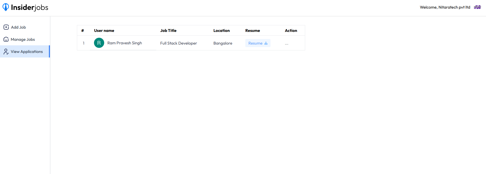
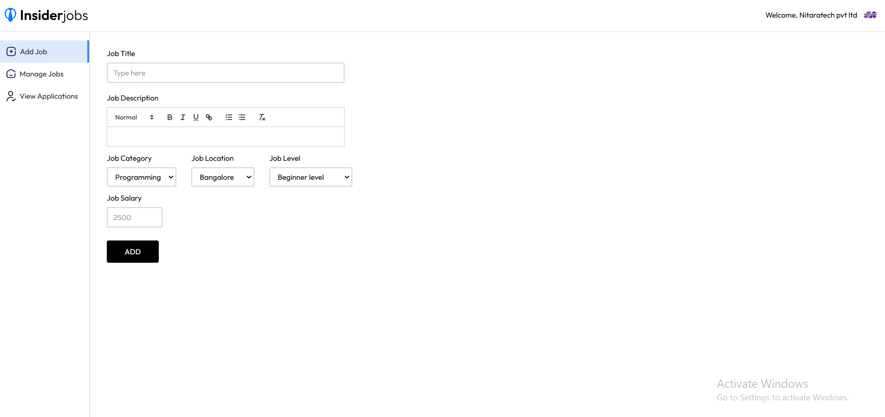

# 💼 MERN Job Portal Platform

A full‑stack Job Portal application that connects **job seekers and
recruiters** through a modern web interface.\
The platform enables companies to post jobs, manage applications, and
track candidates while allowing job seekers to search, apply, and manage
their career opportunities.

This project demonstrates a **production-style MERN architecture** with
authentication, role-based access control, payments, and dashboards.

------------------------------------------------------------------------

# 🚀 Project Overview

The MERN Job Portal provides an end‑to‑end hiring workflow:

• Recruiters can post and manage job openings\
• Candidates can search and apply to jobs\
• Admin can manage users and job listings\
• Secure authentication and role-based authorization\
• Subscription model for recruiters using Stripe

The application is designed to simulate **real-world hiring platforms
like Indeed or LinkedIn Jobs**.

------------------------------------------------------------------------

## 🌐 Live Demo

🚀 https://client-job-portal.vercel.app

------------------------------------------------------------------------

# 🧱 Tech Stack

## Frontend

-   React.js
-   Tailwind CSS
-   Redux Toolkit
-   Axios

## Backend

-   Node.js
-   Express.js
-   REST API architecture

## Database

-   MongoDB
-   Mongoose ODM

## Authentication

-   Clerk Authentication
-   Role-based access (Admin / Recruiter / Candidate)

## Payments

-   Stripe Checkout

## Deployment

-   Vercel
-   CI/CD deployment pipeline

------------------------------------------------------------------------

## 📸 Screenshots

### Homepage


### Job Listings Page


### Job Details Page


### Apply Job


### Applied Jobs Page


### Recruiter Dashboard


### Post Job Page


### Manage Applications


------------------------------------------------------------------------

# ✨ Key Features

## 👨‍💼 Recruiter Features

-   Post new job listings
-   Manage and edit job postings
-   View candidate applications
-   Track recruiter subscription status
-   Premium recruiter features via Stripe subscription

## 👩‍💻 Candidate Features

-   Browse and search available jobs
-   Apply to job postings
-   Upload resume and profile details
-   Track application status
-   Manage personal job applications

## 🛠 Admin Features

-   Manage users and recruiters
-   Monitor job listings
-   Platform administration tools

------------------------------------------------------------------------

# 🏗 Application Architecture

The project follows a **MERN full‑stack architecture**:

Frontend (React)\
⬇\
REST API (Node.js + Express)\
⬇\
Database (MongoDB)

Key modules include:

-   Authentication Module
-   Job Management Module
-   Application Tracking Module
-   Payment & Subscription Module
-   Admin Dashboard Module

------------------------------------------------------------------------

# 📂 Core Modules

### Authentication System

Secure login and signup using **Clerk authentication**, including role
management.

### Job Listing Engine

Recruiters can create and manage job postings with structured job data.

### Application Tracking

Candidates can apply to jobs and track application progress.

### Payment System

Recruiters can upgrade to premium features through **Stripe subscription
integration**.

### Dashboard

Role-based dashboards for **Admin, Recruiters, and Candidates**.

------------------------------------------------------------------------

# ⚙️ Local Development Setup

## Prerequisites

Install the following tools:

-   Node.js
-   MongoDB Atlas account
-   Clerk account
-   Stripe account

------------------------------------------------------------------------

## 1️⃣ Clone the Repository

``` bash
git clone https://github.com/your-username/mern-job-portal.git
cd mern-job-portal
```

------------------------------------------------------------------------

## 2️⃣ Server Setup

Navigate to the server directory:

``` bash
cd server
npm install
```

Create a `.env` file and configure:

    MONGODB_URI=your_mongodb_connection_string
    CLERK_SECRET_KEY=your_clerk_secret
    STRIPE_SECRET_KEY=your_stripe_secret

Run the server:

``` bash
npm run dev
```

------------------------------------------------------------------------

## 3️⃣ Client Setup

Navigate to client folder:

``` bash
cd client
npm install
npm run dev
```

The application will run at:

    http://localhost:3000

------------------------------------------------------------------------

# ☁️ Deployment

The application can be deployed using:

Frontend: **Vercel**\
Backend: **Vercel / Render / Railway**\
Database: **MongoDB Atlas**

------------------------------------------------------------------------

# 📈 Future Improvements

-   Email notifications for job applications
-   Resume AI analysis
-   Job recommendation system
-   Interview scheduling system
-   Real-time notifications

------------------------------------------------------------------------

# 👨‍💻 Author

**Ram Pravesh Singh**\
Full‑Stack Developer (MERN)

------------------------------------------------------------------------

⭐ If you found this project useful, consider giving it a star!
